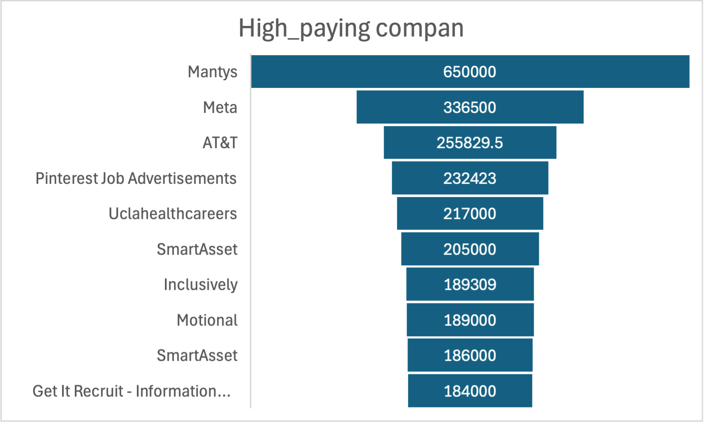
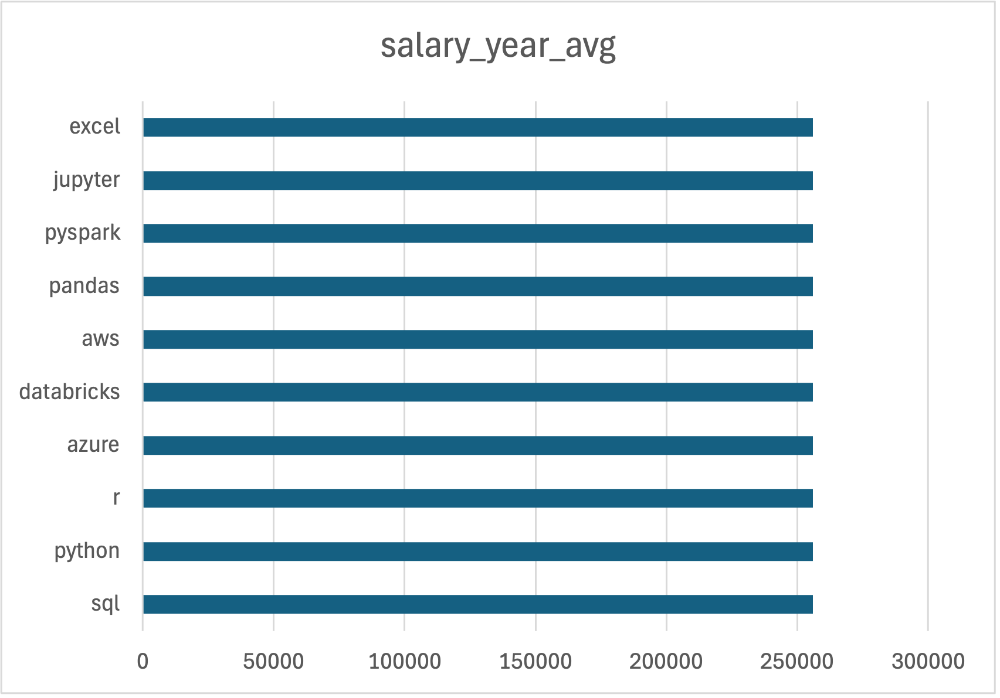
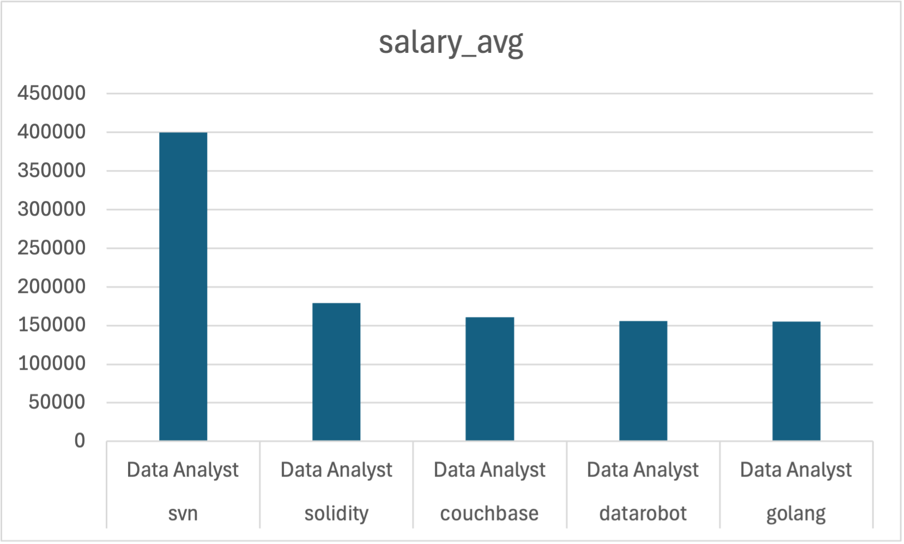
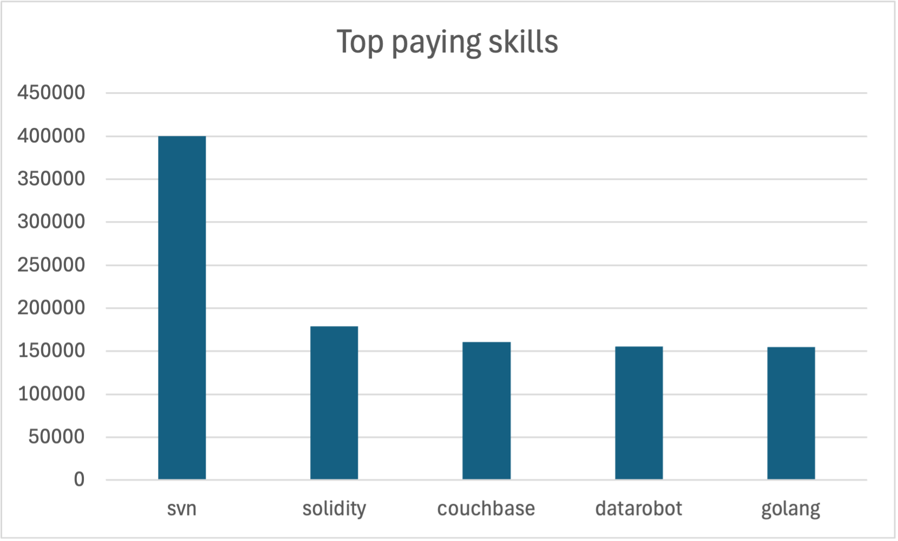
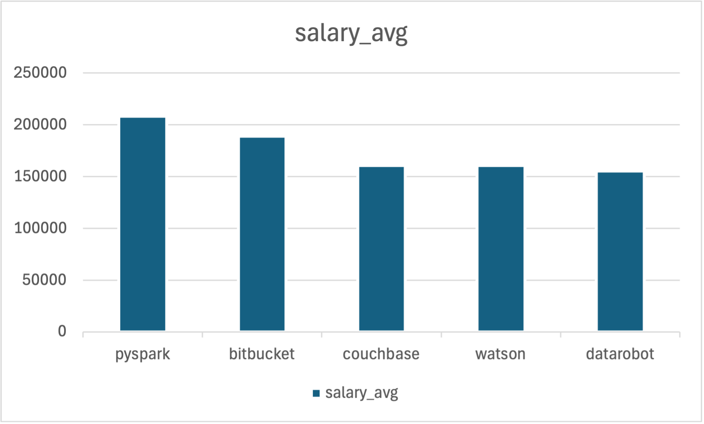

# Introduction
Dive into the data job market! Focusing on data analyst roles, this project explores a top-paying
jobs, in-demand skills, and & where high demand meets high salary in data analytics.

SQL queries? Check them out here: [project_sql folder](/project_sql/)
# Background
Driven by a quest to navigate the data analyst job market more effectively, this project was born from a desire to pinpoint top-plaid and in-demand skills, streamlining others work to find optimal jobs.
### The questions I wanted to answer through my SQL queries were:
1. What are the top-paying data analyst jobs?
2. What skills are required for these top-paying jobs?
3. What skills are most in demand for data analysts?
4. Which skills are associated with higher salaries?
5. What are the most optimal skills to learn?

# Tools I Used
For my deep dive into the data analyst job market, I harnessed the power of several key tools:
- SQL: The backbone of my analysis, allowing me to query the database and unearth critical insights.
- PostgreSQL: The chosen database management system, ideal for handling the job posting data.
- Visual Studio Code: My go-t for database management and executing SQL queries.
- Git & GitHub: Essential for version control and sharing my SQL scripts and analysis, ensuring collaboration and project tracking

# The Analysis
Each query for this project aimed at investigating specific aspects of the data analyst job market.
Here's how I approached each question:
### 1. Top Paying Data Analyst Jobs
To identify the highest-paying roles I filtered data analyst positions by average yearly salary and location, focusing on remote jobs. This query highlights the high paying opportunities in the field.
 ```sql
 SELECT 
    jf.job_title_short,
    cd.name, 
    jf.job_location,
    jf.salary_year_avg
FROM 
    job_postings_fact jf
LEFT JOIN
    company_dim cd ON jf.company_id = cd.company_id
WHERE 
    job_title_short = 'Data Analyst' AND 
    job_location = 'Anywhere' AND 
    salary_year_avg IS NOT NULL
ORDER BY 
    salary_year_avg DESC
LIMIT 10;
```
Here's the breakdown of the top data analyst jobs in 2023:
- **Wide Salary Range:** Top 10 paying data analyst roles span from $184,000 to $650,000, indicating significant
Salary potential in the
field.
- **Diverse Employers:** Companies like SmartAsset, Meta, and AT&T are among those offering high salaries, showing a broad interest across different industries.
- **Job Title Variety:** There's a high diversity in job titles, from Data Analyst to Director of Analytics, reflecting varied roles and specializations within data analytics.

*showing conpaies paying high salary for data analyst role*

### 2. Top Paying Job Skills  
To determine which skills are most associated with high-paying remote data analyst roles, I joined the top-paying jobs with the skills required for each position. This query helps identify the most financially valuable skills in the job market.

```sql
WITH top_paying_jobs AS (
    SELECT 
        job_id,
        jf.job_title_short,
        cd.name,
        jf.job_location,
        jf.salary_year_avg
    FROM 
        job_postings_fact jf
    LEFT JOIN
        company_dim cd ON jf.company_id = cd.company_id
    WHERE 
        job_title_short = 'Data Analyst' AND 
        job_location = 'Anywhere' AND 
        salary_year_avg IS NOT NULL
    ORDER BY 
        salary_year_avg DESC
)
SELECT 
    tj.job_title_short,
    tj.name,
    skills,
    tj.job_location,
    tj.salary_year_avg 
FROM 
    top_paying_jobs tj
INNER JOIN
    skills_job_dim sj ON tj.job_id = sj.job_id
INNER JOIN
    skills_dim sd ON sj.skill_id = sd.skill_id
LIMIT 10;
```
Here's the breakdown of the top paying job skills:

- High-Value Skills: Skills such as SQL, Python, R, Azure, and Databricks are frequently listed in roles paying over $250,000.

- Company Highlight: AT&T dominates the top listings, showing consistent investment in advanced analytics talent.

- Tech Stack Relevance: The mix of programming languages, cloud platforms, and data tools emphasizes the need for well-rounded technical skills.

*salary for top skills*
### 3. Most In-Demand Skills  
This query identifies which skills appear most frequently in remote job postings for data analysts. It reveals the technologies and tools that are currently in high demand.

```sql
SELECT 
    skills,
    job_title_short,
    COUNT(skills) AS demand
FROM 
    skills_dim sd
INNER JOIN
    skills_job_dim sj ON sd.skill_id = sj.skill_id
INNER JOIN
    job_postings_fact jf ON sj.job_id = jf.job_id
WHERE
    jf.job_title_short = 'Data Analyst' AND
    jf.job_work_from_home = True
GROUP BY
    jf.job_title_short,
    sd.skills
ORDER BY demand DESC
LIMIT 5;
```
Here's the breakdown of the most in-demand skills:

- SQL Dominates: Appears in over 7,000 remote job postings, making it the most requested skill for remote data analyst roles.

- Excel and Python: These foundational tools are critical in data cleaning, analysis, and automation, explaining their high demand.

- Visualization Tools in Demand: Tableau and Power BI are essential for building dashboards and reports, making them core to modern data workflows.

*Demaned skill in the data analyst filed*
### 4. Top Paying Skills  
This analysis calculates the average salary for each skill by looking at all data analyst job postings that mention it. It identifies the highest-paying individual skills across the job market.

```sql
SELECT 
    skills,
    job_title_short,
    ROUND(AVG(salary_year_avg), 2) AS Salary_avg
FROM 
    skills_dim sd
INNER JOIN
    skills_job_dim sj ON sd.skill_id = sj.skill_id
INNER JOIN
    job_postings_fact jf ON sj.job_id = jf.job_id
WHERE
    jf.job_title_short = 'Data Analyst' AND
    salary_year_avg IS NOT NULL
GROUP BY
    skills,
    jf.job_title_short
ORDER BY Salary_avg DESC
LIMIT 5;
```
Here's the breakdown of the top paying skills:

- Specialized Tools Lead: SVN, Solidity, and Couchbase top the list, with salaries reaching up to $400,000.

- Blockchain Relevance: Solidity, a language used for smart contracts, reflects the growing overlap between data analytics and blockchain technologies.

- Niche Skills, High Reward: Tools like Datarobot and Golang show that less common but specialized skills can significantly boost salary potential.

*Top paying skills including all jobs whiv pays highest salary*
### 5. Optimal Skills (High Salary & High Demand)  
This query combines demand and salary data to find skills that are not only well-paid but also frequently requested. These are considered optimal for job seekers looking for both strong compensation and broad opportunities.

```sql
WITH skills_demand AS (
    SELECT 
        sd.skill_id,
        skills,
        COUNT(skills) AS demand
    FROM 
        skills_dim sd
    INNER JOIN
        skills_job_dim sj ON sd.skill_id = sj.skill_id
    INNER JOIN
        job_postings_fact jf ON sj.job_id = jf.job_id
    WHERE
        jf.job_title_short = 'Data Analyst' AND
        salary_year_avg IS NOT NULL AND
        jf.job_work_from_home = True
    GROUP BY
        sd.skill_id
), average_salary AS (
    SELECT 
        sd.skill_id,
        skills,
        ROUND(AVG(salary_year_avg), 2) AS Salary_avg
    FROM 
        skills_dim sd
    INNER JOIN
        skills_job_dim sj ON sd.skill_id = sj.skill_id
    INNER JOIN
        job_postings_fact jf ON sj.job_id = jf.job_id
    WHERE
        jf.job_title_short = 'Data Analyst' AND
        salary_year_avg IS NOT NULL AND
        jf.job_work_from_home = True
    GROUP BY
        sd.skill_id
)
SELECT 
    skd.skill_id,
    skd.skills,
    demand,
    Salary_avg 
FROM 
    skills_demand skd
INNER JOIN average_salary ON skd.skill_id = average_salary.skill_id
ORDER BY Salary_avg DESC
LIMIT 5;
```
Here's the breakdown of the most optimal skills:

- Best of Both Worlds: Pyspark and Bitbucket provide a strong balance of high demand and average salaries over $180K.

- AI & Automation Tools: Skills like Datarobot and Watson are linked to advanced analytics and AI, reflecting rising industry trends.

- Career Smart Picks: These skills offer a great return on investment for learners by combining earning potential with active job market relevance.

*Optimal skill by demand and salary given for data analyst role*
### 📊 Conclusion

This analysis provides a comprehensive overview of the data analyst job market based on job postings, salaries, and skill requirements. By leveraging SQL queries and structured datasets, the following key insights emerged:

- 💼 **Remote Work is Lucrative:** Remote data analyst roles offer salaries ranging up to $650,000, with major tech and finance firms leading the way.
- 🧠 **High-Paying Skills Are Often Specialized:** Tools like `SVN`, `Solidity`, and `Couchbase` command top-tier salaries, showing the value of niche expertise.
- 📈 **Most In-Demand Skills Are Practical and Widely Used:** `SQL`, `Excel`, and `Python` top the charts in demand, reinforcing their foundational role in data work.
- 💡 **Optimal Skills Combine Demand and Salary:** Technologies like `Pyspark` and `Bitbucket` strike the ideal balance between being in demand and offering high pay—making them great upskilling targets.
- 🛠️ **BI and Cloud Tools Are Crucial:** Skills like `Power BI`, `Tableau`, `Azure`, and `Databricks` consistently appear in both high-paying and high-demand job listings.

Overall, the findings suggest that while mastering core tools like SQL and Python is essential, learning specialized or emerging technologies can significantly boost salary potential. This project can help aspiring and current data analysts make informed decisions about skill development and career planning in a competitive job market.


